# Malware Analysis Report – APT29 C2-Client Dropbox Loader

[[Sample + IDA database to
download]](https://github.com/Dump-GUY/Malware-analysis-and-Reverse-engineering/blob/main/APT29_C2-Client_Dropbox_Loader/Sample%2BIDA_IDB.7z)
– **Password:infected** 
[[Download PDF Report]](https://github.com/Dump-GUY/Malware-analysis-and-Reverse-engineering/blob/main/APT29_C2-Client_Dropbox_Loader/APT29-DropboxLoader_analysis.pdf)  

1.  <ins>**Basic Information**</ins>

    Malicious sample was spread via spear-phishing attack targeted at government
    organizations with attachment “Meeting Info.img”. The attachment “Meeting
    Info.img” is disc image file format containing 5 files. Abusing this kind of
    file format “.img” is leveraging available mounting capability of Windows OS
    (8, 8.1, 10, 11), preserving of file attributes and NOT supporting ADS
    (Alternate Data Stream) specifically the “Zone.Identifier” (Mark of the
    Web). In case of “Meeting Info.img”, 4/5 files have set “hidden” file
    attribute and after mounting the “.img” file, Windows OS will not show them
    in default settings as we can see in the picture below.

    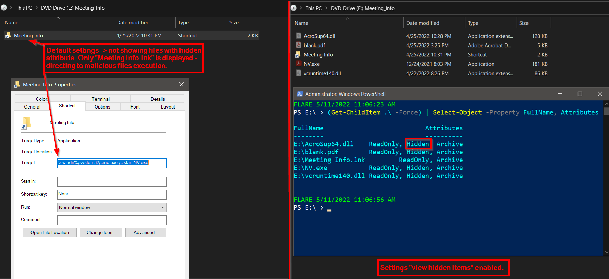

    After clicking the “Meeting Info.lnk”, hidden program “NV.exe” is executed.
    DLL hijacking (DLL search order) is abused as “NV.exe” (not malicious
    program “Original Filename: WCChromeNativeMessagingHost.exe” of company
    Adobe Systems Inc. – digitally signed) is loading modified version of
    “vcruntime140.dll” (added record for “AcroSup64.dll” in Import Directory)
    from application directory and because of that, malicious library code
    “AcroSup64.dll” is executed.

    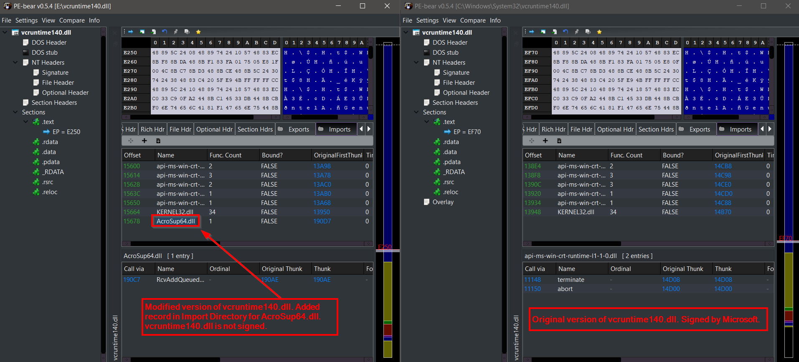

    Execution of “NV.exe” abusing DLL hijacking and modified version of
    “vcruntime140.dll” to load an execute malicious “AcroSup64.dll”.

    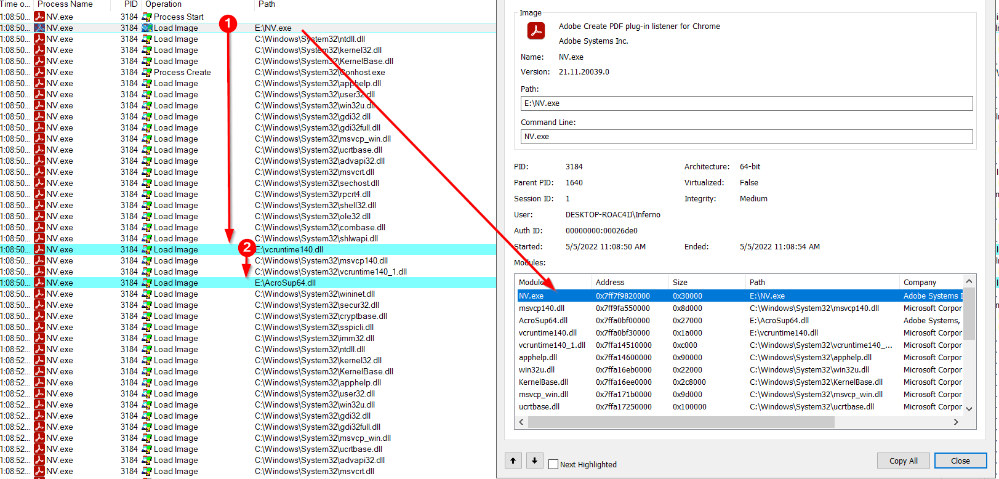

    Because of the main functionality and malicious code resides in
    “AcroSup64.dll”, further analysis will be focused on this file.  

2.  <ins>**Static Code Analysis – “AcroSup64.dll”**</ins>

    Upon library loading “AcroSup64.dll”, the first function (functions
    “DllEntryPoint” and “dllmain_dispatch” are not important in this case) which
    is performing the intended malicious behavior and gets automatically
    executed is “DllMain”.

    Right in start of function “DllMain”, we can see that first anti-analysis
    check is performed. Code is checking if main process module filename is
    “NV.exe” same as the delivered original filename of program responsible for
    loading “AcroSup64.dll”. <ins>Be aware that through whole this analysis - all
    code is already annotated and retyped in IDA IDB and functions are renamed
    according to their capabilities.</ins>

    

    We can also see the first thread execution hijacking which is processed via
    calling directly “NtCreateThreadEx” syscall. New thread is created in
    suspended state with flags set also to hide from debugger. Decoy start
    routine “RtlNewSecurityObjectWithMultipleInheritance” of newly created
    thread is replaced with setting the thread context of this thread –
    specifically via setting RCX register (NOT RIP as this new suspended thread
    is not initiated yet) pointing to code where the execution will be directed.
    This serves well as AV evasion and anti-debug technique. RCX is the first
    argument to function “RtlUserThreadStart” (thread start location) and this
    argument sets new thread entry routine different than the decoy one.

    The “NtCreateThreadEx” syscall is dynamically resolved and gets executed
    directly via “syscall” assembly instruction where desired syscall number is
    set in RAX register, as we can see in the picture below:

    

    

    Resolving of syscalls is done via function “resolve_and_hash_all_syscalls”
    only once, on first execution. “resolve_and_hash_all_syscalls” function is
    hashing syscall names and populates it to table named as
    “hashed_syscalls_table”. This table later serves as lookup table to find
    specific syscall number for routine. Function
    “resolve_and_hash_all_syscalls”:

    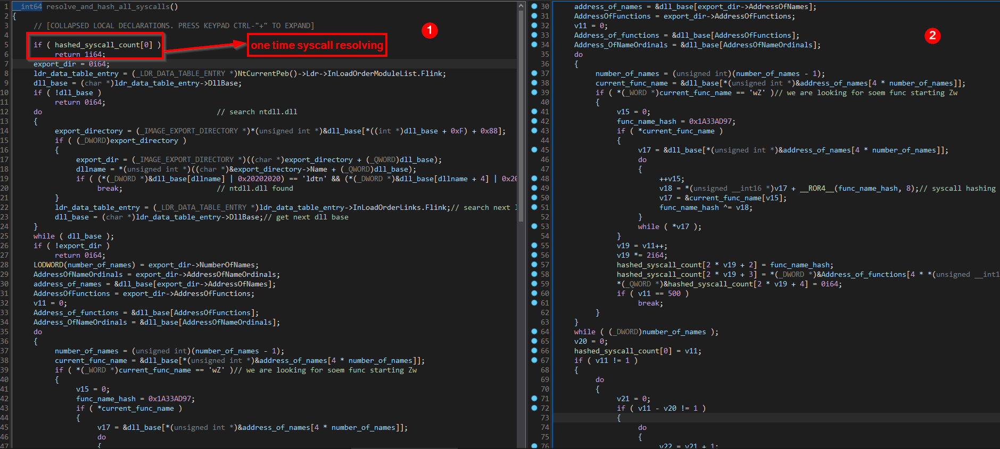

    Whenever we see this kind of advanced technique (dynamic resolving of
    syscall via syscall name hashing and creating “hashed_syscalls_table” which
    serves as lookup table + direct syscall call via stub code similar like in
    ntdll.dll) we should do a little OSINT if this technique is based on some
    already published one.

    In this case, our assumption was correct and this technique is based on
    “SysWhispers2” published on Github [[GITHUB -
    SysWhispers2]](https://github.com/jthuraisamy/SysWhispers2/blob/main/data/base.c).
    C2-Client Dropbox Loader was reusing most of the original code from
    “SysWhispers2” also the syscall name hashing algorithm so with this
    information we can take some structures and implement it in IDA to get
    better understanding of this code like in pictures below:

    Using “hashed_syscalls_table” as lookup table for desired syscall hash to
    retrieve its syscall number:

    

    Hashing syscall names and populating + reordering the
    “hashed_syscalls_table”:

    

    The main point of this kind of retrieving syscall numbers for routines is
    based on the fact that syscall numbers are in ascending order strictly
    connected to order of syscall´s virtual addresses “Zw\*” inside of ntdll.dll
    – meaning that lowest virtual address of syscall = lowest number of syscall
    (highest virtual address of syscall = highest number of syscall). We can
    confirm this fact/idea with simple [[python
    script]](https://github.com/Dump-GUY/Malware-analysis-and-Reverse-engineering/blob/main/APT29_C2-Client_Dropbox_Loader/Resolve_syscall_numbers_via_VA_ntdll.py)
    \+ ntdll.dll in IDA:

    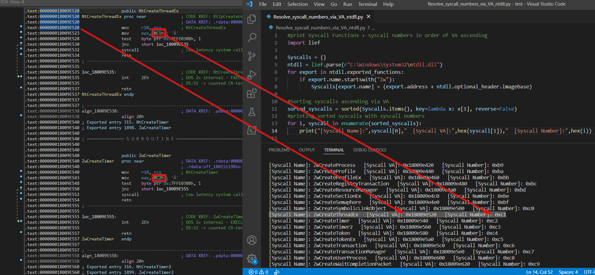

    Now when we have knowledge how this technique works, we can focus on syscall
    name hashing algorithm which after annotating and retyping looks similar
    like below:

    

    This hashing routine we can easily reproduce in [[IDA Python
    script]](https://github.com/Dump-GUY/Malware-analysis-and-Reverse-engineering/blob/main/APT29_C2-Client_Dropbox_Loader/APT29syscall_hashing_syswhisper2_ENUM_IDAPython.py)
    and create ENUM for all Syscall hashes:

    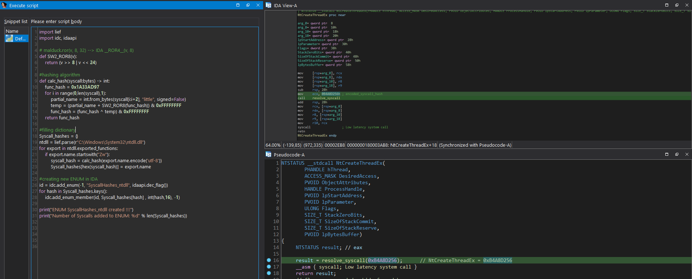

    So whenever we see hashed syscall name, we can apply newly created ENUM and
    after we find out the correct invoked routine, we can retype whole function.

    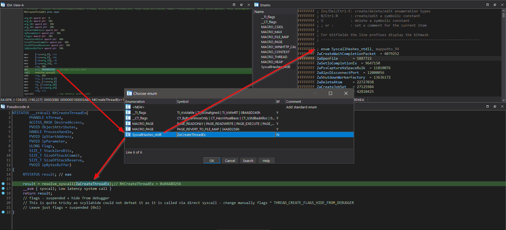

    We can get back to the first thread execution hijacking -
    “Pre_C2client_MAIN_redirect_exec” is the function where thread execution
    hijacking directs to. This function can be seen in the picture below.
    Function is trying to find “NV.exe” module name in memory and if found,
    another thread execution hijacking occurs. This time it hijacks already
    existing thread (no new thread created) and because of that, code can just
    set RIP register of thread context. Newly set RIP register is pointing to
    function named “C2_Client_MAIN” where all the main malicious C2 activity is
    implemented.

    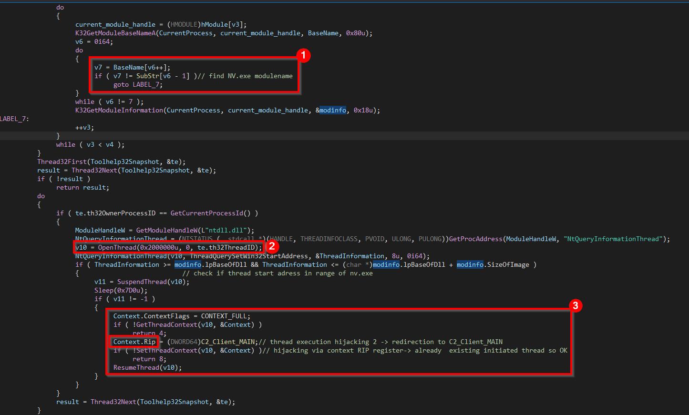

    Start of function “C2_Client_MAIN” can be seen in the picture below. First
    what this function is doing, is calling function
    “Map_dll_restore_text_section”. After this, C2_client tries to authenticate
    itself to Dropbox service and if authentication is successful (there is
    unintentional exception – see below “http_dropbox_authenticate” function
    analysis), it sets persistence and continue with Dropbox communication
    otherwise it waits 5.5 minutes and try to authenticate itself again. All is
    performed in endless loop.

    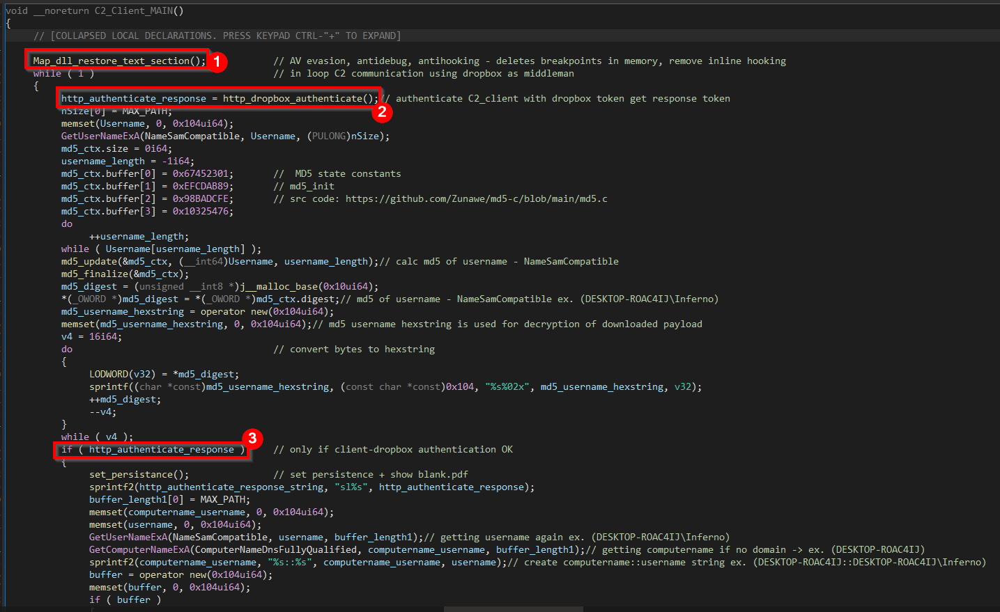

    “Map_dll_restore_text_section” function serves well as AV evasion,
    anti-debug and anti-hooking technique as this function is searching for all
    already loaded modules (WININET.dll is the last one if found), finding them
    on disc, manually maps their “.text” (code) section into memory and replace
    with it the one “.text” section in corresponding library already loaded in
    memory. With this, malware destroys all installed inline hooks of AV and set
    breakpoints of debugger if any. So the AV solution will be blind from the
    user-space (ring 3) perspective.

    We can see function “Map_dll_restore_text_section” in the picture below:

    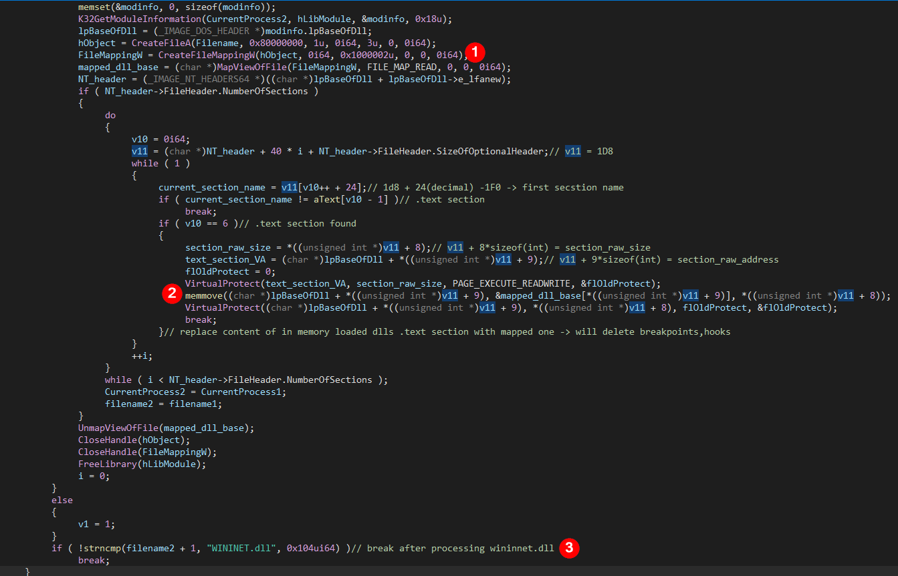

    Back to the main function “C2_Client_MAIN”, “http_dropbox_authenticate”
    function is responsible for decoding strings related to authenticate the
    C2_Client on Dropbox service. It uses hardcoded token for authentication and
    if the token is still valid (not expired/revoked) it will receive another
    temporary token for further communication with Dropbox.

    <ins>One probably unintentional bug in code</ins> (function
    “http_dropbox_authenticate”) there is possibility that code will try to set
    persistence and continue in further communication (with wrong string content
    interpreting as bearer access token) even if authentication is not
    successful. This is caused by obtaining authentication response fulfilling
    certain format condition as explained in the picture below:

    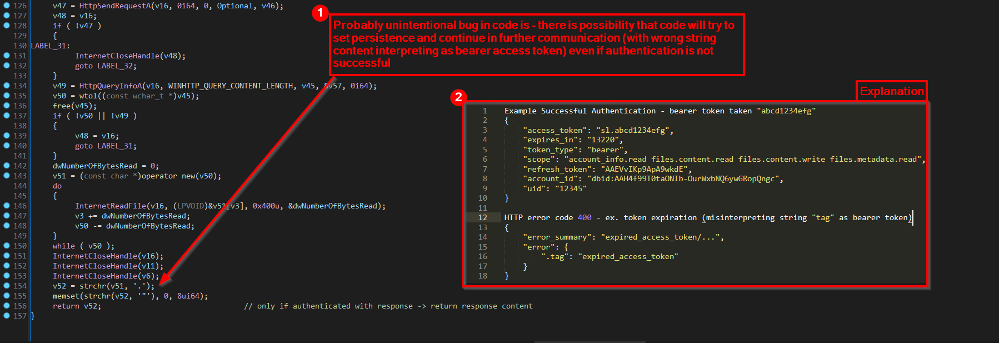

    Decoded strings of function “http_dropbox_authenticate” can be seen in the
    picture below and contains information like HTTP User-Agent, HTTP Host name
    (api.dropbox.com), URL path, Basic authorization HTTP header and mainly the
    Token itself.

    

    We can also see that before the code reach the part of setting persistence
    (after authentication) it obtains current logged-in username (in
    NameSamCompatible format) calculates MD5 hash of it and converts it to
    hexstring. This hexadecimal string of Username MD5 is very important because
    it is later used to decrypt downloaded payload from Dropbox before
    execution.

    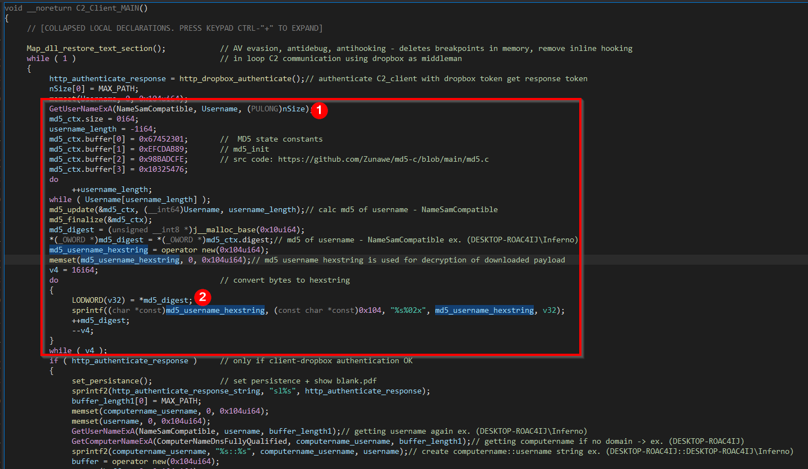

    According to usage of Username MD5 hexstring which is used for downloaded
    payload decryption, we can assume how C2 Dropbox server (serving payload to
    Dropbox) operates “per-victim” and is using infected currently logged-in
    Username MD5 hexstring for “per-victim” payload encryption. The expected
    functionality of infrastructure according to C2 Dropbox client code is in
    the picture below:

    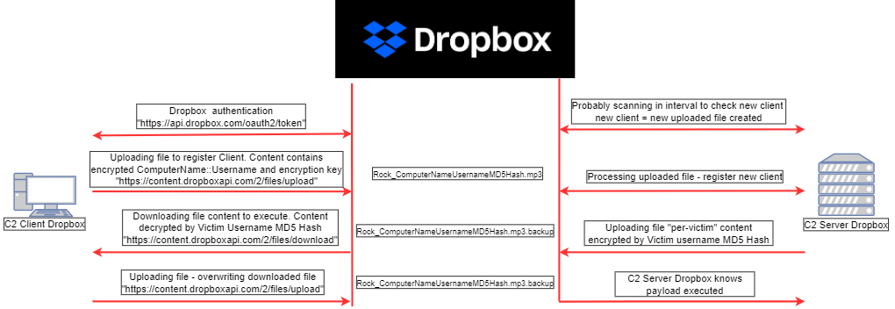

    Function “set_persistance” is spawning new process to open “blank.pdf” file.
    After that it starts to copy files “NV.exe”, “AcroSup64.dll” and
    “vcruntime140.dll” into the “%USERPROFILE%\\AppData\\Roaming\\AdobeAcroSup”
    directory and sets

    persistence via ordinary auto-start location for current user “run” registry
    “HKEY_CURRENT_USER\\SOFTWARE\\Microsoft\\Windows\\CurrentVersion\\Run” with
    value name “Adobe AcroSup” and value data pointing to
    “%USERPROFILE%\\AppData\\Roaming\\ AdobeAcroSup\\NV.exe”.

    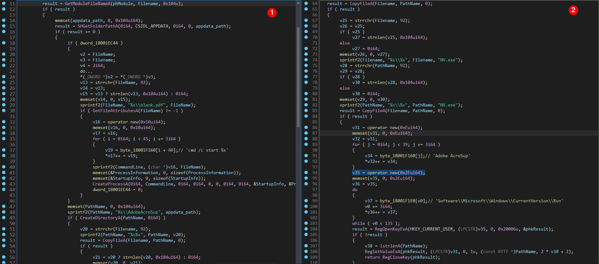

    Function “C2_Client_MAIN” continue execution and after “set_persistance”
    function it gets currently logged-in Username and Computername and creates
    string from it in format “Computername::Username”. In next step, this string
    is xored with hardcoded value “ME3.99.5UUUUUUUUUUUUUUUUUUUUUUUUUUUU” (which
    looks very similar to original LAME MP3 encoder header) as in the picture
    below.

    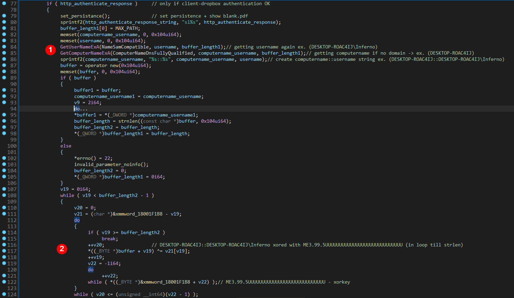

    In next step, it calculates MD5 hash from string “Computername::Username”,
    converts it to hexstring format and uses it to create filename for uploading
    to Dropbox “Rock_ComputerNameUsernameMD5HashHexstring.mp3” – registering
    Client to C2 Dropbox Server (ex.
    “Rock_70a1e27ba30dd415155e68409d512a2d.mp3”).

    

    Next function “pre_process_body_add_mp3header_xorkey” is preparing body
    content of “Rock_ComputerNameUsernameMD5HashHexstring.mp3” to upload. The
    body content contains xored “Computername::Username”, xor key
    “ME3.99.5UUUUUUUUUUUUUUUUUUUUUUUUUUUU” and to avoid detection - fictive MP3
    header is added to the start of body content. The example structure of this
    body content is in the picture below:

    

    This body is uploaded by function “http_dropbox_upload”:

    

    Decoded strings from function “http_dropbox_upload” (ex. HTTP User-Agent,
    HTTP Host “content.dropboxapi.com”, URL Path “/2/files/upload”) can be seen
    in the picture below:

    

    The next step is preparing filename to download from Dropbox. This file is
    uploaded to Dropbox by C2 Dropbox Server. Filename to download is in format
    “Rock_ComputerNameUsernameMD5HashHexstring.mp3.backup” (ex.
    “Rock_70a1e27ba30dd415155e68409d512a2d.mp3.backup”) so the same as filename
    which was uploaded by Client but with “.backup” added.

    

    Function responsible for downloading payload with filename
    “Rock_ComputerNameUsernameMD5HashHexstring.mp3.backup” is
    “http_dropbox_download”. Decoded strings of function “http_dropbox_download”
    (ex. HTTP User-Agent, HTTP Host “content.dropboxapi.com”, URL Path
    “/2/files/download”) can be seen in the picture below:

    

    Function responsible for processing downloaded payload is
    “process_exec_downloaded_payload”. Before stepping into this function we can
    see some first structure checks of obtained payload which will later help to
    recreate example structure of delivered payload.

    

    Function “process_exec_downloaded_payload” is responsible for processing
    downloaded payload, decrypting it with xor key “Username MD5 hash hexstring”

    (ex. "70c29c906cfa19759fa4776ea7c0973e") and creating new thread to execute
    it.

    

    First what we can see is xor decryption of downloaded payload which avoids
    processing first 21 bytes and last 36 bytes. Xoring starts with 22. byte of
    downloaded content and ends (content_length -57 +21). According to this, we
    can assume example of the downloaded payload format (“X” – unknown,
    “PAYLOAD_CODE_ENCRYPTED” – encrypted code with unknown length which will be
    later executed) as in the picture below:

    

    In next step, this function is allocating enough executable memory for
    decrypted code. After this, syscalls “NtWriteVirtualMemory” and
    “NtCreateThreadEx” are resolved in similar manner as syscalls before via
    “resolve_syscall” function using already created table named
    “hashed_syscalls_table”. This table is used as lookup table to find specific
    syscall number for routine.

    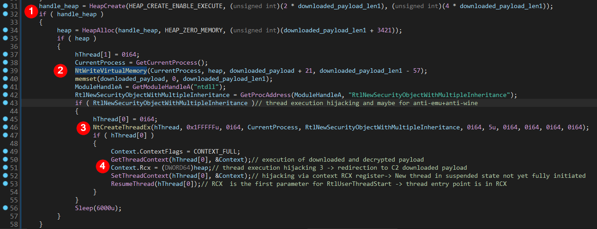

    Syscall “NtWriteVirtualMemory” is used to to write decrypted code to newly
    allocated executable memory. Syscall “NtCreateThreadEx” is used to create
    new thread in suspended state with flags set also to hide from debugger.

    Decoy start routine “RtlNewSecurityObjectWithMultipleInheritance” of newly
    created thread is replaced with setting the thread context of this thread –
    specifically via setting RCX register (NOT RIP as this new suspended thread
    is not initiated yet) pointing to decrypted code, already written to
    executable memory. Again this combination of directly called syscalls and
    thread execution hijacking serves as AV evasion and anti-debug technique.
    RCX is the first argument to function “RtlUserThreadStart” (thread start
    location) and this argument sets new thread entry routine (downloaded,
    decrypted code) different than the decoy.

    After the downloaded and decrypted payload is executed in new thread,
    execution in current thread comes back to the main function
    “C2_Client_MAIN”.

    Another uploading to Dropbox is processed. This uploading is overwriting the
    same filename which was downloaded
    “Rock_ComputerNameUsernameMD5HashHexstring.mp3.backup”

    (ex. “Rock_70a1e27ba30dd415155e68409d512a2d.mp3.backup”).

    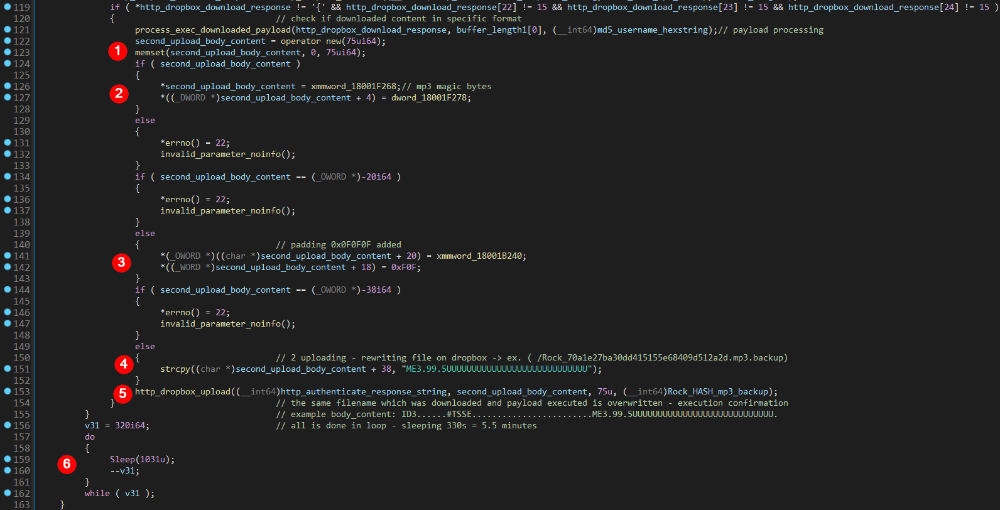

    This serves probably to confirm execution of downloaded code. The content
    for Dropbox uploading which will be overwriting filename -

    “Rock_ComputerNameUsernameMD5HashHexstring.mp3.backup” is created again with
    fictive MP3 header, padding and “ME3.99.5UUUUUUUUUUUUUUUUUUUUUUUUUUUU”
    string which was previously used as xor key. Structure of this content can
    be seen in the picture bellow:

    

    All the main functionality of function “C2_Client_MAIN” -

    (without function “Map_dll_restore_text_section” – performed only once) is
    executed in endless loop when after each loop the execution sleeps for 5.5
    minutes.  

3.  <ins>**Conclusion**</ins>

    APT29 C2-Client Dropbox Loader is abusing many advanced techniques for AV
    evasion, anti-debug and network detection.

    Techniques used: DLL hijacking, main process module filename check, thread
    execution hijacking, decoy start routine of newly created thread, hidden
    thread creation, dynamic syscall numbers resolving via hashing
    (“SysWhispers2”), direct syscall calling via stub code, unhooking via
    replacing “.text” section of in memory modules for manually mapped ones,
    fictive “MP3” header in network content, string encoding and network content
    encryption.

    It abuses legitimate “Dropbox” service which acts as middleman between C2
    Dropbox client and C2 Dropbox server communication. C2 Dropbox server
    operates “per-victim” and encrypts code to be executed by C2 Dropbox client
    with “per-victim” key.

    Token for Dropbox authentication was not valid anymore during the analysis
    so the next stage payload could not be downloaded. We can assume that
    similar payload as Cobalt Strike beacon would be downloaded.  

4.  <ins>**Indicators of compromise (IOCs)**</ins>

    **Malicious:**

    ================================================== 
    Filename: AcroSup64.dll 
    MD5: b3b1c5acf3da24e08a655e976309b181 
    SHA1: 156fcc4008f2fc3034634c3a620b80727d3f3c95 
    SHA-256: 6618a8b55181b1309dc897d57f9c7264e0c07398615a46c2d901dd1aa6b9a6d6 
    File Size: 130,560 
    Extension: dll 
    ================================================== 

    ================================================== 
    Filename: Meeting Info.lnk 
    MD5: 5a4a54eaec3e383f57df3adb61bec68c 
    SHA1: dea84f0c4a5a1a30c5740010ff09941be5fb172b 
    SHA-256: 244c101f10b722b352faa1160fce05f4e19a2d840b70ef054da26de7dbb0a9da 
    File Size: 1,538 
    Extension: lnk 
    ================================================== 

    ================================================== 
    Filename: vcruntime140.dll 
    MD5: 60e11cc61bc2eeee039f7aa98f96676c 
    SHA1: b078c8a1a04c297983a148bae0ec3aa76c7a81fa 
    SHA-256: 2028c7deaf1c2a46f3ebbf7bbdf76781d84f9321107d65d9b9dd958e3c88ef5a 
    File Size: 88,064 
    Extension: dll 
    ================================================== 

    **Benign:**

    ================================================== 
    Filename: blank.pdf 
    MD5: 1c32d785398e3a7eaab0e9b876903cc6 
    SHA1: 3dad168e79bc7f421760c98a8b6be2e1630a63ec 
    SHA-256: 0622971147486e1900037eff229d921d14f5b51aac7171729b2b66f81cdf6585 
    File Size: 4,911 
    Extension: pdf 
    ================================================== 

    ================================================== 
    Filename: NV.exe 
    MD5: bcb225e7f9a3fc81429de70f7b124a02 
    SHA1: dedca09d9a97f719a970883eeaa570434f9ecaba 
    SHA-256: e8e63f7cf6c25fb3b93aa55d5745393a34e2a98c5aeacbc42f1362ddf64eb0da 
    File Size: 184,544 
    Extension: exe 
    ================================================== 
