# Debugging MBR - IDA + Bochs Emulator (CTF example)

This post will explain how to setup Bochs Emulator to debug MBR in IDA
environment on Windows OS. It could be quite useful if we are struggling with
some kind of MBR Locker/Wiper or another kind of MBR modifier where we have to
RE the bootstrap code.

A master boot record (MBR) is a special type of boot sector at the very
beginning of partitioned computer mass storage devices like fixed disks or
removable drives. The MBR consists of 512 bytes located in the first sector of
the drive.
We are especially interested in analyzing the Bootstrap code area which starts at file offset 0x0000.

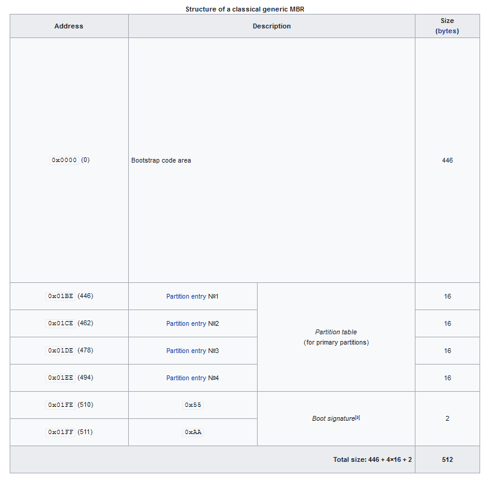

First of all, we could be in situation where we have the infected drive or
already carved out MBR “bin file”. If we have the infected drive, we could carve
out the first 512 bytes of it with some Hex editor or Unix “dd” command-line
utility etc…

As an example in this post, we will be using MBR from one of challenges
CrowdStrike Intelligence Adversary Quest [[CrowdStrike Intelligence Adversary
Quest]](https://www.crowdstrike.com/blog/join-crowdstrike-intelligence-adversary-quest/)
CTF.

This challenge was called “The Proclamation”. We simple got MBR bin file and
have to obtain the right flag.

MBR to download from this challenge is available here [[MBR
sample]](https://github.com/Dump-GUY/Malware-analysis-and-Reverse-engineering/blob/main/Debugging%20MBR%20-%20IDA%20%2B%20Bochs%20Emulator/My_MBR).

## Installing Bochs Emulator

Download and install Bochs x86 PC emulator available here [[Bochs x86 PC
emulator]](https://sourceforge.net/projects/bochs/). IDA is recommending version
v2.6.x. The latest version now (30. 1. 2021) is 2.6.11 so this should be ok.

## Creating a Bochs Disk Image

Now we have to create Bochs disk image where we will inject our MBR sample. Open
a new Administrator Command Prompt window. In the Administrator Command Prompt window, navigate to install directory of
Bochs emulator and run these commands to create Bochs Disk image:

**cd C:\\Program Files\\Bochs-2.6.11**

**bximage.exe**

The "bximage" tool launches, as shown below.

Enter these items:

-   **1** to create a new image
-   **Enter** for "hd"
-   **Enter** for "flat"
-   **Enter** for 512 byte hard disk sectors
-   **Enter** for size "10"
-   **Enter** to accept the default name or rename to " my_new_image_.img"
-   **Enter** to continue and exit bximage

## Creating the Configuration File

In the Administrator Command Prompt window, execute these commands:

**notepad bochsrc.bxrc**

A Notepad box pops up, asking if we want to create a new file.

Click **Yes**.

Enter this text into Notepad, as shown below.

**megs: 512** 
**romimage: file="BIOS-bochs-latest"** 
**vgaromimage: file="VGABIOS-lgpl-latest"** 
**boot: cdrom, disk** 
**ata0-master: type=disk, path="my_new_image_.img", mode=flat** 
**mouse: enabled=0** 
**cpu: ips=90000000** 
 
Be careful on the “path” parameter – must match the name we chase during image
creation.

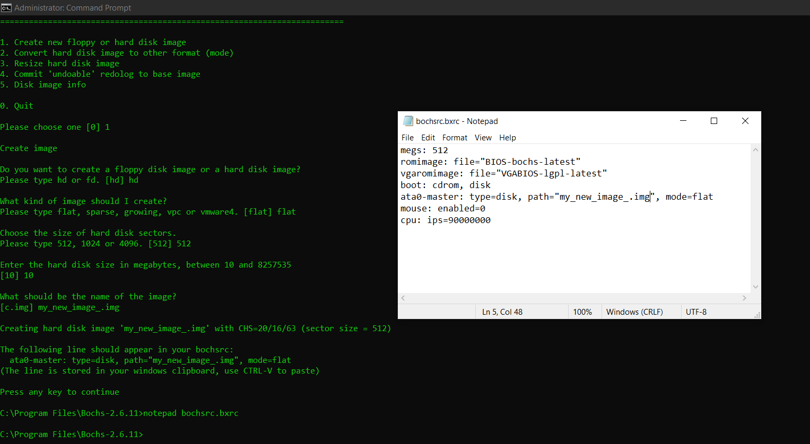

In Notepad, click **File**, **Save**. Close Notepad.

## Injecting MBR in newly created Bochs Disk Image

When we are injecting our MBR bin file we are simply replacing first 512 bytes
of created Bochs image “my_new_image_.img” with 512 bytes of our MBR. We can do
this in any HEX editor or simply with python as you can see in the picture
below.

We can check that 512 bytes of MBR were really injected in Bochs Disk Image in
Hex editor:

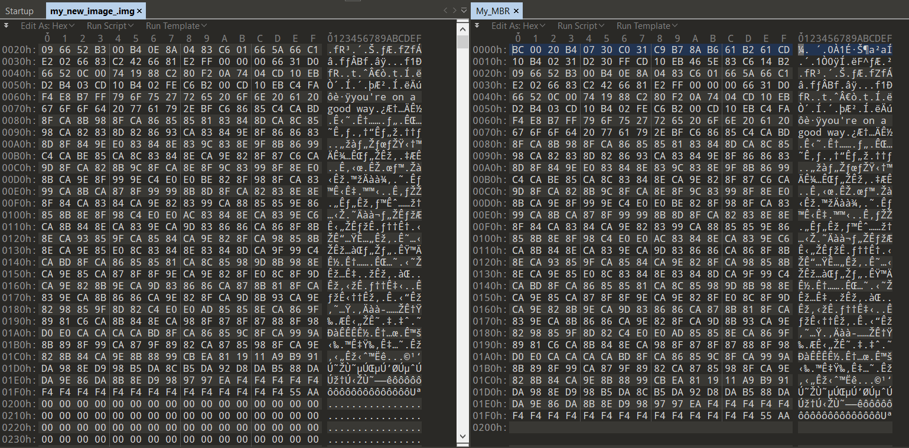

Opening previously created configuration file “bochsrc.bxrc” in IDA.

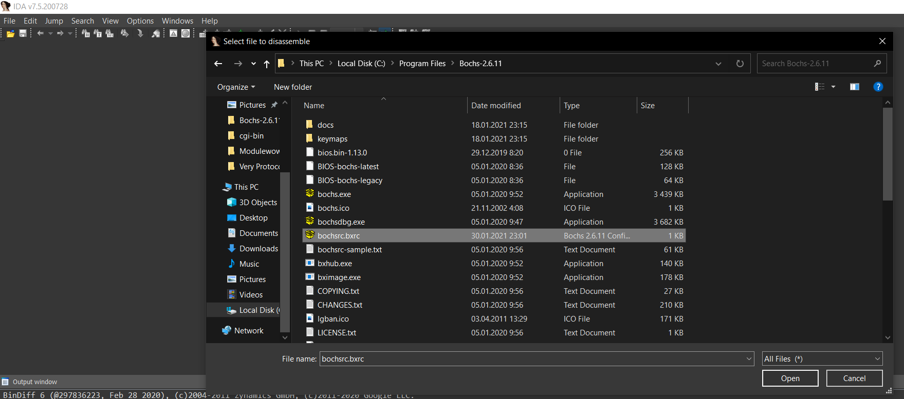

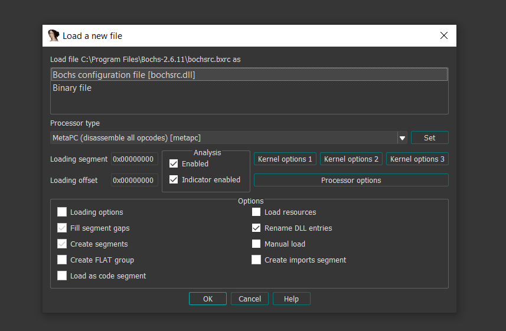

If IDA got a problem with locating the Bochs debugger “bochsdbg.exe”, check the dbg_bochs.cfg in location
(“IDA install directory\\cfg\\dbg_bochs.cfg”) and modify the (BOCHSDBG =
"C:\\\\Program Files\\\\Bochs-2.6.11\\\\bochsdbg.exe";) to point to the location
where we installed the Bochs emulator.

We do not have to bother with the line “//BOCHSRC = "c:\\\\program files\\\\IDA
Pro 7.5\\\\cfg\\\\bochsrc.cfg";” because we already gave IDA the Bochs
configuration file as “bochsrc.bxrc”.

## Let´s start debugging

Put a breakpoint on the start address „BOOT_SECTOR:7C00“. Don´t be surprised
about the 0x7C00 address – little explanation:

A bootloader runs under certain conditions. The following pertains to
bootloaders initiated by the PC BIOS:

-   The first sector of a drive contains its boot loader.

-   One sector is usually 512 bytes — the last two bytes must be 0xAA55 (i.e.
    0x55 followed by 0xAA), or else the BIOS will treat the drive as unbootable.

-   If everything is in order, said first sector will be placed at RAM address
    0000:7C00, and the BIOS's role is over as it transfers control to 0000:7C00.
    (I.e. it JMPs to that address)

IDA sets almost everything for us automatically after opening “bochsrc.bxrc”
file but in case we would not like to use the Bochs configuration file and want
to analyze the bootstrap code of MBR alone just remember to load it as x86 16
bit LE code.

Start debugging:

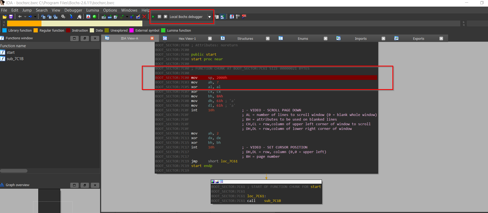

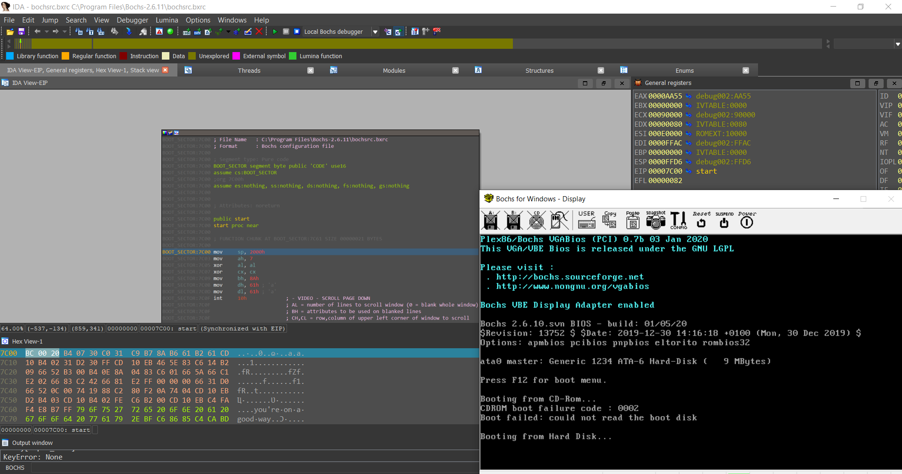

Now we are in state of debugging bootstrap code of MBR so next section will be
focusing on solving the challenge “The Proclamation” of CrowdStrike Intelligence
Adversary Quest [[CrowdStrike Intelligence Adversary
Quest]](https://www.crowdstrike.com/blog/join-crowdstrike-intelligence-adversary-quest/)
CTF.

MBR to download from this challenge is available here [[MBR
sample]](https://github.com/Dump-GUY/Malware-analysis-and-Reverse-engineering/blob/main/Debugging%20MBR%20-%20IDA%20%2B%20Bochs%20Emulator/My_MBR).

## Analyzing and solving challenge “The Proclamation”

At first, when we reach breakpoint on the start address 0x7C00, we can see two
interrupts and calling function sub_7C1B.

These two interrupts are only setting cursor position and color of the
background and foreground text which will be printed as it is described in the
picture below.

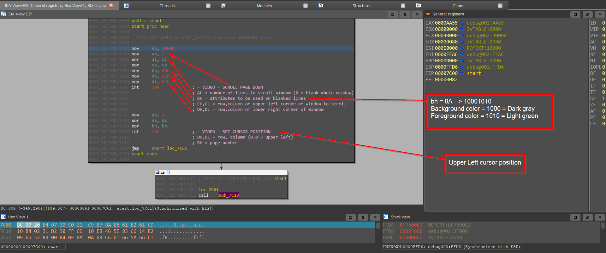

IDA already helped us a lot with arguments description. But for sure, below is more information to INT 10h / AH =
07h

For BH value as attribute is table explaining this value below.

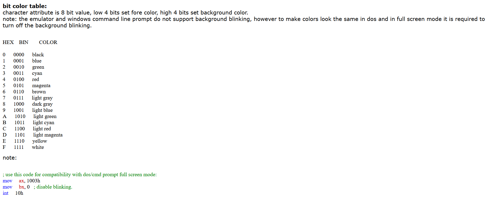

So the background color is set to Dark grey and foreground color is set to light
green. Cursor position is upper left. Let’s move on to analyzing function
sub_7C1B.

In sub_7C1B we can immediately see some XOR routine.

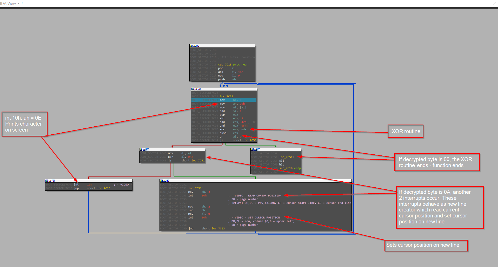This function is basically
reading byte after byte from some offset and decrypt it via XOR routine. If
decrypted byte is 00, the XOR routine ends – function ends. If decrypted byte is
0A, another 2 interrupts occur. These interrupts behave as new line creator
which read current cursor position and set cursor position on new line. If
decrypted byte is not 00 or 0A, another interrupt occurs – int 10h, ah = 0E
Prints character on screen (this interrupt is described below). All this routine
we can see annotated:

Description “int 10h, ah = 0E”:

We can clearly see that first byte which will be decrypted on address 0x7C78,
the value of this byte is 2E:

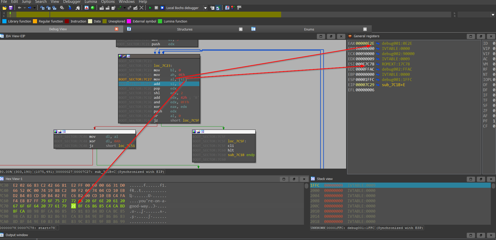

Let´s put a breakpoint on the jump address when decrypted byte is 00 (loc_7C5F).
After we continue debugging, we can see that decrypted text is printed on the
screen.

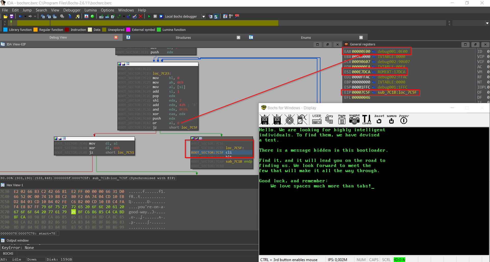

But as we can see, the flag is somehow missing. Let´s note the SI value = 0x7DCA
which is pointing on the next byte which could be decrypted if decrypted byte 00
did not occur.

The main point is that there is more data to be decrypted after decrypted byte
00 which ends our decryption function. Restart the debugging and put a
conditional breakpoint on address 0x7C44 (SI==0x7DCA), where conditional jump
occurs and is done if decrypted byte is 00.

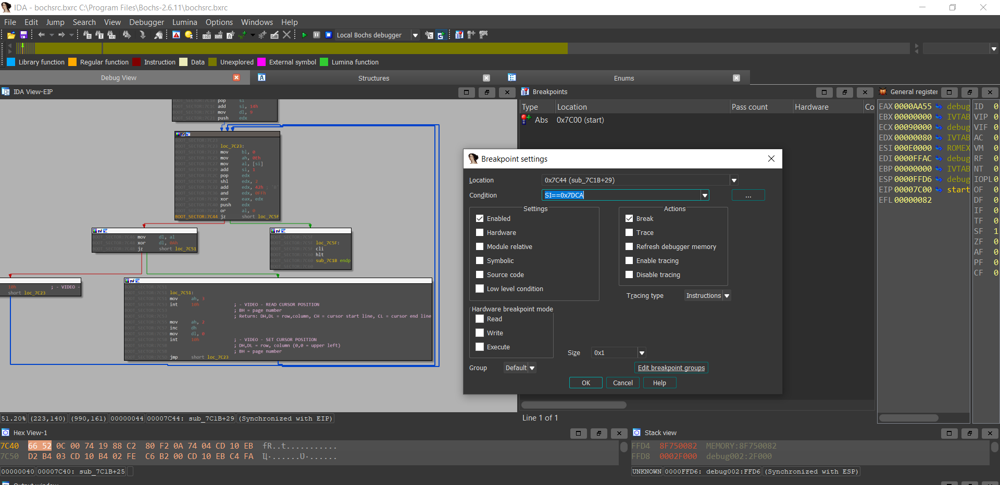Setting the conditional
breakpoint on address 0x7C44 when value of SI register is 0x7DCA:

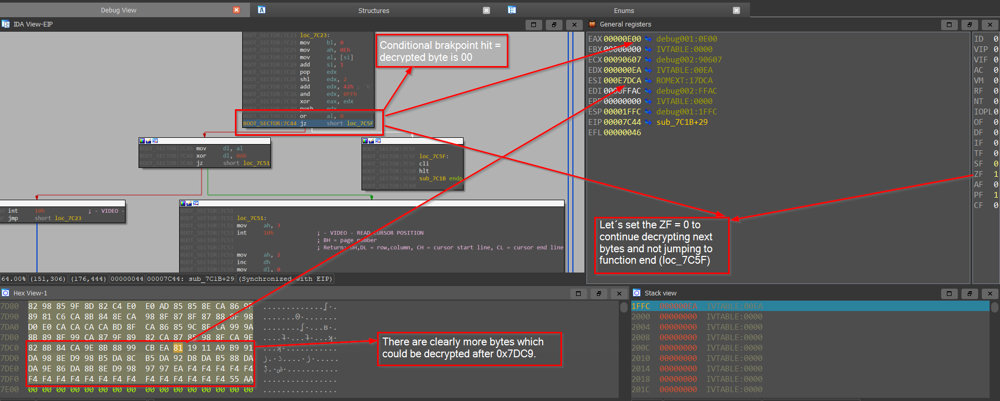Continue debugging. We reached
our conditional breakpoint. We can clearly see that there is more data which
could be decrypted in the picture below (check the VA address 0x7DCA).

When we want to continue in
decryption routine, we can simply change the value of ZF =0 and not performing
jump to the function end. Press continue and check the output in Bochs emulator
display.

And here it is - CS{0rd3r_0f_0x20_b00tl0ad3r} – Our winning flag.

## Author:

[[Twitter]](https://twitter.com/vinopaljiri)

[[Github]](https://github.com/Dump-GUY)
