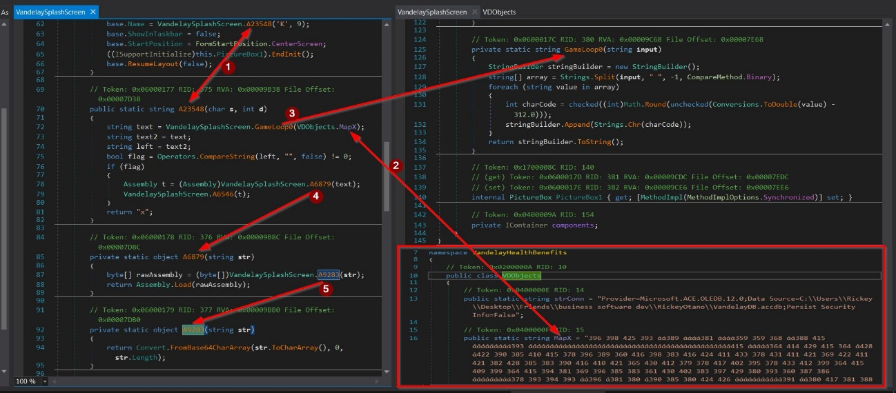
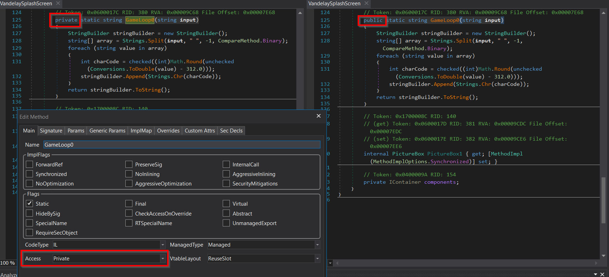
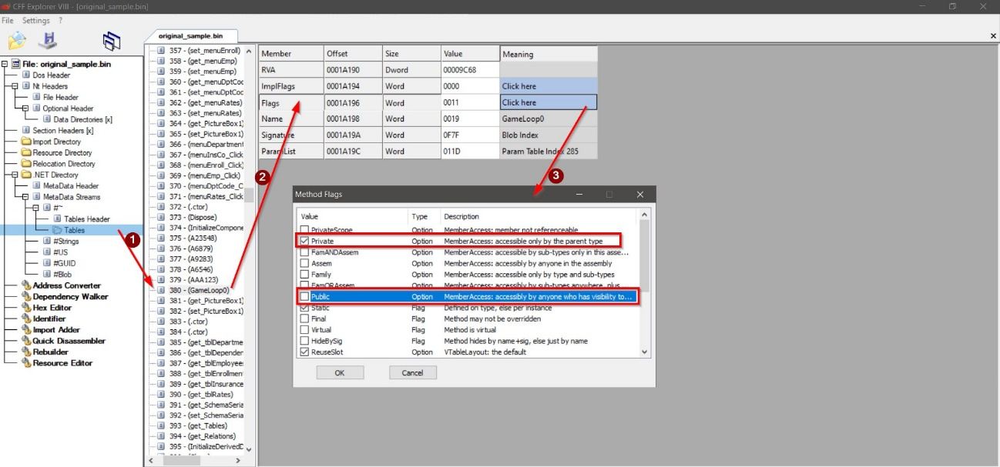
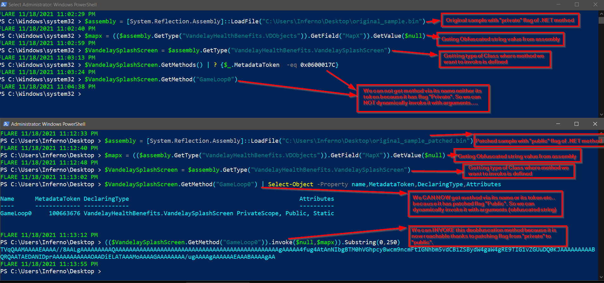
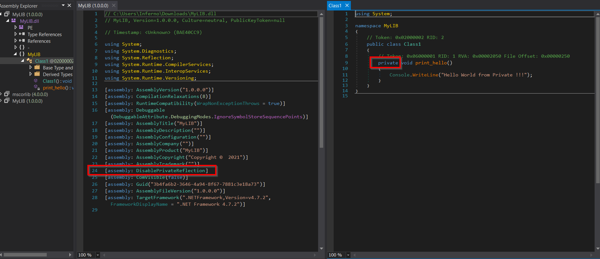
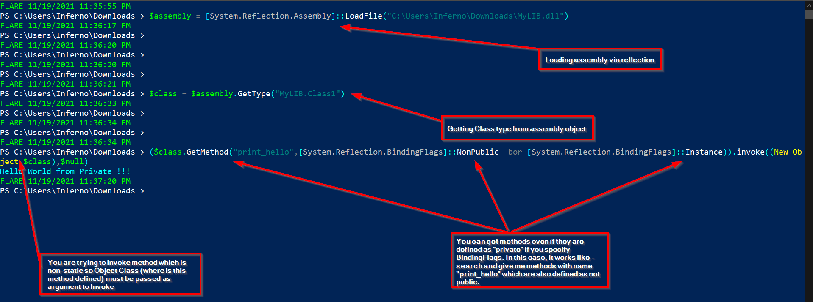
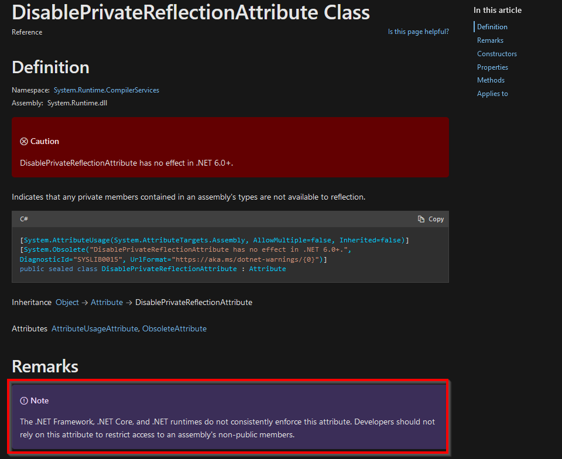
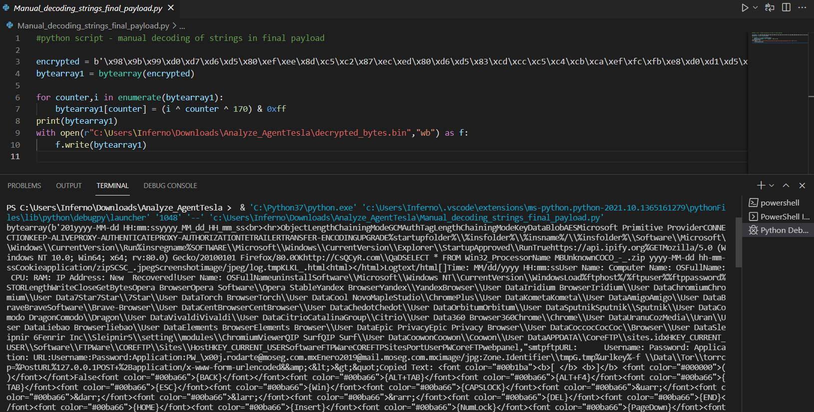
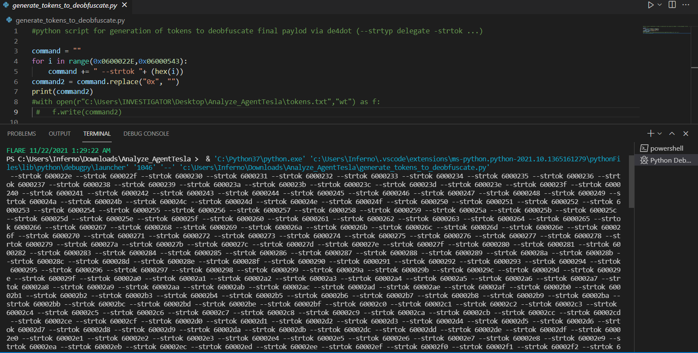

# Powershell and DnSpy tricks in .NET reversing – AgentTesla

The original sample of AgentTesla: MD5: e7c0b04e6a639e611d8f97897fa62b63

### Download here:

[[Github - Pass: infected]](https://github.com/Dump-GUY/Malware-analysis-and-Reverse-engineering/blob/main/Reversing%20.NET%20-%20AgentTesla/part1/AgentTesla_Original_sample.zip) 
[[Hybrid-Analysis]](https://www.hybrid-analysis.com/sample/fb0db7fe3b3f1c1276b4c9240cb29ca36be79e0f193c001c33ed9784ecf6d079) 

### Brief Information:

AgentTesla is .NET based keylogger, RAT and stealer readily available to actors.
Logs keystrokes and the host's clipboard, extracts passwords and other
information and beacons it back to the C2. More Info AgentTesla: [[Malpedia -
AgentTesla]](https://malpedia.caad.fkie.fraunhofer.de/details/win.agent_tesla)

## [1] Part1 – Reversing path to the final payload

Video: []

This part covers extraction of all stages during reversing original sample and
obtaining final payload. Most of the video is about advanced usage of DnSpy like
in memory patching obfuscated modules for deobfuscated which got loaded runtime
as next stages. I will provide simple way how one can benefit from views like
Call Stack, Memory View, Modules View, Locals etc.. In memory (during runtime)
replacing obfuscated next stage modules for deobfuscated ones is one of the
trick which will be shown. Many tricks how one can interact with .NET assembly
via Powershell will be introduced (Loading .NET assembly, Invoking methods (even
private), patching methods, getting assembly field values etc..). The biggest
advantage all of this is that we will have all execution process under control.

### Highlights Covered in Video:

In the picture below we can see decoding routines which are used for dynamically
loading stage1 module via reflection.

Below is Powershell oneliner [[Download Here]](https://github.com/Dump-GUY/Malware-analysis-and-Reverse-engineering/blob/main/Reversing%20.NET%20-%20AgentTesla/part1/Agetn_Tesla_Stage1_decoder_Oneliner.ps1) which is used for manual decoding
stage1 module. All steps are explained in video.

As we are already using reflection in powershell we do not have to implement
manually decoding routines and we can invoke these decoding routine directly
from assembly. One problem could be that deobfuscation methods are defined as
“private”. There are more workaround for this. One is to patch original assembly
with tools like DnSpy, CFF Explorer or Cerbero Suite.

Patching method flag “Private” to “public” in DnSpy:

Patching method flag “Private” to “public” in CFF Explorer:

Patching method flag “Private” to “public” in Cerbero Suite:

Comparing deobfuscation methods Invoking (patched original_sample “private” flag
to “public” vs NOT patched). 
Powershell script [[Download Here]](https://github.com/Dump-GUY/Malware-analysis-and-Reverse-engineering/blob/main/Reversing%20.NET%20-%20AgentTesla/part1/Agetn_Tesla_Stage1_decoder_Dynamic-Invoke.ps1)

We can also do the stage1 decoding fully manually in python [[Download Here]](https://github.com/Dump-GUY/Malware-analysis-and-Reverse-engineering/blob/main/Reversing%20.NET%20-%20AgentTesla/part1/Agetn_Tesla_Stage1_decoder.py):

Another workaround is that we can actually invoke methods defined as "private"
also even if attribute "[assembly: DisablePrivateReflection]" is used without
assembly patching. The key is in specifying “System.Reflection.BindingFlags”.
You can see example Assembly “MyLIB.dll” [[Download Here]](https://github.com/Dump-GUY/Malware-analysis-and-Reverse-engineering/blob/main/Reversing%20.NET%20-%20AgentTesla/part1/MyLIB.dll) and Powershell script [[Download Here]](https://github.com/Dump-GUY/Malware-analysis-and-Reverse-engineering/blob/main/Reversing%20.NET%20-%20AgentTesla/part1/Example_MyLib_invoke_privateMethod.ps1):

## [2] Part2 – Final Payload “AgentTesla” Reversing and deobfuscation

Video: []

In this video, we will be reversing final stage payload. We will perform full
deobfuscation using tool de4dot, manual string decoding via Powershell and
Python. [[Final_Payload - Pass: infected]](https://github.com/Dump-GUY/Malware-analysis-and-Reverse-engineering/blob/main/Reversing%20.NET%20-%20AgentTesla/part2/final_payload.zip) 

Powershell string decoding script via Methods Invoke [[Download Here]](https://github.com/Dump-GUY/Malware-analysis-and-Reverse-engineering/blob/main/Reversing%20.NET%20-%20AgentTesla/part2/Decoding_strings_viaMethodsInvoke_final_payload.ps1) 

Powershell string decoding script via Getting Byte Field - Invoking cctor [[Download Here]](https://github.com/Dump-GUY/Malware-analysis-and-Reverse-engineering/blob/main/Reversing%20.NET%20-%20AgentTesla/part2/Decoding_strings_via_GetingField_invoking_cctor.ps1) 

Python string decoding script [[Download Here]](https://github.com/Dump-GUY/Malware-analysis-and-Reverse-engineering/blob/main/Reversing%20.NET%20-%20AgentTesla/part2/Manual_decoding_strings_final_payload.py) 

Python MD Token generation script [[Download Here]](https://github.com/Dump-GUY/Malware-analysis-and-Reverse-engineering/blob/main/Reversing%20.NET%20-%20AgentTesla/part2/generate_tokens_to_deobfuscate.py) 

## References - Tools:

DnSpy - <https://github.com/dnSpy/dnSpy> 
CFF Explorer – https://ntcore.com/?page_id=388 
Cerbero Suite - <https://cerbero.io/> 
De4dot - <https://github.com/de4dot/de4dot> 

## References - .NET internals information:

Karsten Hahn (@struppigel) - Understanding .NET Streams and Metadata: 
https://youtu.be/RkqW5S_e8AU 

Alexandre Borges (@ale_sp_brazil) - .NET MALWARE THREAT: INTERNALS AND REVERSING: 
http://www.blackstormsecurity.com/docs/ALEXANDREBORGES_DEFCON_2019.pdf 
https://youtu.be/UB3pVTO5izU 

Pavel Yosifovich (@zodiacon) - Windows 10 internals for .NET developers: 
https://youtu.be/h6BXMcRqYhA 
