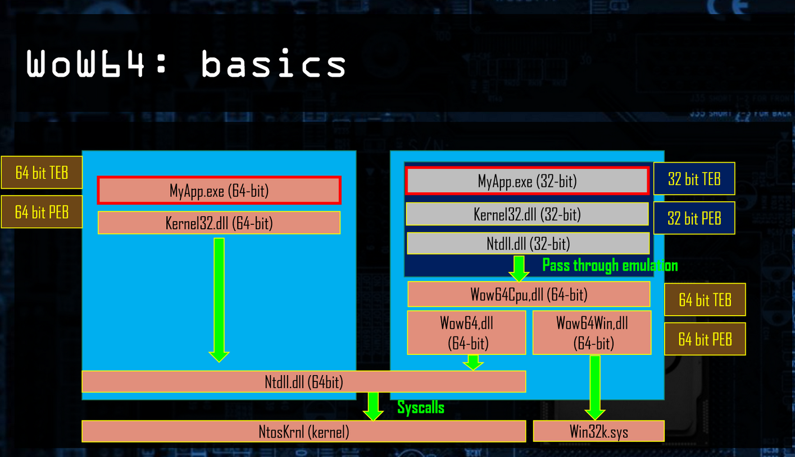

# WINDBG Kernel&User mode debugging
# Walking through System structures EPROCESS, KPROCESS, ETHREAD, KTHREAD, TEB, PEB and their using
 
 
## Let’s start:

### Generating shellcode 32bit and 64bit with msfvenom - metasploit framework:

32bit shellcode - msfvenom.bat -p windows/exec CMD=calc.exe -o shellcode32.sc

64bit shellcode - msfvenom.bat -p windows/x64/exec CMD=calc.exe -o
shellcode64.sc

### Wrap it to exe to make it simply debuggable:

shellcode2exe.bat 32 shellcode32.sc wrapped_sc32.exe

shellcode2exe.bat 64 shellcode64.sc wrapped_sc64.exe

Compare the produced wraped shellcode/exe in IDA focus on API resolving -
imports retrieving:

TEB -\> PEB -\> \_PEB.Ldr -\> \_PEB_LDR\_DATA.InMemoryOrderModuleList.Flink -\>
\_LDR_DATA_TABLE_ENTRY.FullDllName.Buffer

\_LDR_DATA_TABLE\_ENTRY.FullDllName.MaximumLength

## Brief Information:

### Segment Registers FS(32bit) vs GS(64bit):

Used to point to operating system defined structure (manage thread-specific
memory) -\> TEB

TEB -\> pointer FS:[0x30] and GS:[0x60] -\> address of Process Environment Block
(PEB)

### About System structures (EPROCESS, KPROCESS, ETHREAD, KTHREAD, TEB, PEB):

TEB and PEB can be accessed from User Mode - Contains Process and thread
specific information.

EPROCESS and KPROCESS can be accessed only from Kernel Mode --\> Representing
Process object in Kernel.

ETHREAD and KTHREAD can be accessed only from Kernel Mode --\> Representing
Thread object.

EPROCESS contains pointer to KPROCESS structure and to PEB.

ETHREAD contains pointer to KTHREAD structure and KTHREAD structure contains
pointer to TEB.

64bit processes on 64bit Processor architecture contains 1x64 bit structure of
PEB and 1x64 bit structure of TEB.

32bit processes on 32bit Processor architecture contains 1x32 bit structure of
PEB and 1x32 bit structure of TEB.

32bit processes on 64bit Processor architecture contains 1x32 bit structure of
PEB + 1x64 bit structure of PEB and 1x32 bit structure of TEB + 1x64 bit
structure of TEB. (WoW64 emulation)

You can see below as described before (Picture from [[Hasherezade Windows
Malware Analysis
training]](https://github.com/hasherezade/malware_training_vol1))

### Simple explanations EPROCESS vs KPROCESS:

When you are creating process, both the Kernel and the Executive Subsystems want
to track it.

Kernel for example wants to deal with the priority and affinity of the threads
in the process because that's going to affect scheduling.

The Executive Subsystem wants to track the process for example because of
Security Executive Subsystem wants to associate a token with the process so
security checking could occur.

The structure that the Kernel uses to track the process is the KPROCESS.

The structure that the Executive Subsystems use to track process is the
EPROCESS.

The KPROCESS is the first field of the EPROCESS, so the Executive Subsystems
allocate the EPROCESS structure and then call the Kernel to initialize the
KPROCESS.

Both structures are part of the Process Object that represents the instance of
user process.

BOTH are located in kernel memory space. The names, if I understand it well,
come from names of subsystems that interact with these structures. EPROCESS
\-executive, KPROCESS -kernel.

## Settings for exercise:

Kernel debugging with Windbg Preview in Host -\> debugging Guest VM:

### **Guest VM:**

CMD as administrator:

bcdedit /debug on

bcdedit /dbgsettings serial debugport:1 baudrate:115200 (assuming the port is
COM1)

shut down the VM

go into the settings for our Virtualbox Windows VM:

Serial Ports -\> Port1 -\> Enable serial port

Port number COM1

Port Mode -\> Host Pipe

Uncheck “Connect to existing pipe/socket”,

Path/Address -\> \\\\.\\pipe\\MalDBG

Start VM

### **HOST:**

Install Windbg Preview

Go to File -\> "Start Debugging” and select “Attach to Kernel”

Go to COM tab -\> Check Pipe and Reconnect

Resets 0

Baud Rate 115200

Port \\\\.\\pipe\\MalDBG

Uncheck Break on connection

Click OK - To attach to kernel of our VM

## Steps:

### WINDBG:

Run wrapped_sc32.exe - break on entrypoint

Run wrapped_sc64.exe - break on entrypoint

Differences between 32bit process TEB/PEB and 64bit TEB/PEB

Showing System structures like EPROCESS, KPROCESS, ETHREAD, KTHREAD

### XNTSV:

Restart VM and press F8 during boot to enter Advanced Boot Options -\> Disable
Driver Signature Enforcement (To enable loading of unsigned drivers)

Run wrapped_sc64.exe - break on entrypoint - WINDBG

Run XNTSV and attach to PID of wrapped_sc64.exe:

Showing TEB/PEB

Showing System structures like EPROCESS, KPROCESS, ETHREAD, KTHREAD

## Useful commands:

Windbg commands (User Mode):

User Mode WINDBG for both (wrapped_sc32.exe, wrapped_sc64.exe):

Run exe

GO to entrypoint in Disassembly - @\$exentry

Breakpoint on entrypoint - bp @\$exentry

Continue to reach breakpoint

Examine the TEB structure:

dt ntdll!\_TEB @\$teb

Use (dt ntdll!\_TEB @\$teb -r2) for showing recursive 2 nested records

Examine the \_PEB structure:

dt ntdll!\_PEB @\$teb+0x30 or dt ntdll!_PEB @\$peb (or peb address)

dt ntdll!\_PEB\* - list all variables that contain the word \_PEB

dt ntdll!\_PEB_LDR_DATA 0x776e0200 (address pointed by ldr in PEB)

dt ntdll!\_LDR_DATA_TABLE_ENTRY 0x544768 (address pointed by \_PEB_LDR_DATA -\>
InMemoryOrderModuleList)

dt ntdll!\_UNICODE_STRING 0x2b4768+0x024

Windbg Preview commands (Kernel Mode):

!process 0 0 -list all processes (Obtain Process ID of our required process end
address of EPROCESS structure)

dt \_eprocess fffffa80044c4850 -Eprocess structure of process object (Check
first element - address pointing to KPROCESS structure, CHECK PEB)

!process ab0 7 - 7 for getting more information about our process ID=ab0 (Check
address of THREAD = address of ETHREAD structure)

dt \_Ethread fffffa8004490060 - get ETHREAD structure (Check first element -
address pointing to KTHREAD structure)

Check KTHREAD structure - contains TEB

## More information and useful links:

### **Hasherezade Malware analysis course:**

<https://github.com/hasherezade/malware_training_vol1/blob/main/slides/module1/Module1_3_process.pdf>

<https://github.com/hasherezade/malware_training_vol1/blob/main/slides/module1/Module1_4_wow64.pdf>

### **Common WinDbg Commands:**

<http://windbg.info/doc/1-common-cmds.html>

### **Tools:**

Windbg Preview - Microsoft

Windbg - Microsoft

XNTSV – <https://github.com/horsicq/xntsv>

shellcode2exe - <https://github.com/repnz/shellcode2exe>
